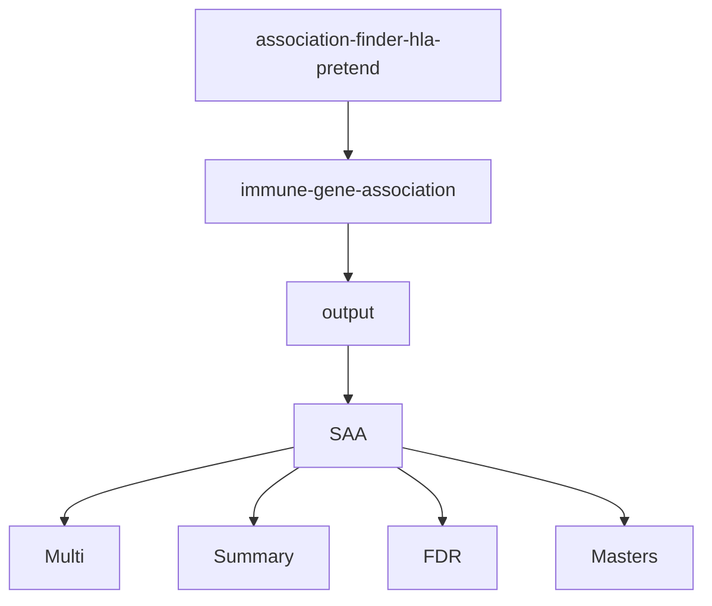

# association-finder-hla-pretend
This repository contains scripts to perform HLA disease association studies using a disease association pipeline developed in R called AssociationFinderHLA. AssociationFinderHLA was designed to run on the command line. It can identify allele, haplotype, and genotype associations. 
## Scripts in AssociationFinderHLA:
All of these scripts should be present in the /immune-gene-association directory.
### 1_find_associations_final.R:
This script identifies the associations and calculates summary statistics for each analysis category. It produces output in the /Multi and /Summary subdirectories.
### 2_fdr_correction_final.R: 
Since multiple comparisons are being made in each analysis category, correction for false discovery rate is required. This script produces output in the /FDR and /Summary subdirectories.
### 3_factor_analysis_final.R: 
Factor analysis is performed to organize associated HLA variants into groups based on the underlying structure in the data. The output goes to the /Multi subdirectory.
### 4_master_tables_final.R: 
This script organizes the associations and factor analysis group assignments into tables for each population. It produces output in the /Masters subdirectory.
### 5_final_tables_final.R: 
This script writes an Excel file with the association results for each population sorted by p-value and and factor analysis group assignment. It produces output in the /Masters subdirectory. 
## Other required files:
All of these files should be present in the /immune-gene-association directory.
### HLA typing files:
These files contain the IDs, disease indicators, and HLA typing for the cases and controls. They should be named with the prefix "HLA_input_" followed by the disease, population, imputation replicate number, and the file extension ".txt". This is how the a file should be named if it contains HLA typing for cases with severe aplastic anemia (SAA) in the Asian & Pacific Islander population and is the first imputation replicate: 
**HLA_input_SAA_API_1.txt**

In the HLA typing files, the IDs occupy the first column, **ID**, and the disease indicators occupy the second column, **Disease_Ind**. A value of "1" in the Disease_Ind column identifies a case, while a value of "0" identifies a control. The other columns in the file contain HLA typing for individual alleles, haplotypes, and genotypes. This is how the input data should look for a case with the HLA typing *A\*11:01\~C\*12:03\~B\*38:01\+A\*24:02\~C\*08:02\~B\*14:02* and a control with the HLA typing *A\*01:01\~C\*07:01\~B\*08:01\+A\*01:01\~C\*07:01\~B\*08:01*:
|    ID    | Disease_Ind |  A1  |  C1  |  B1  |  A2  |  C2  |  B2  | Hap_A1_C1 | Hap_A2_C2 |    Geno_A_C_B    |
| -------- | ----------- | ---- | ---- | ---- | ---- | ---- | ---- | --------- | --------- | ---------------- |
|24537890|1|A\*11:01|C\*12:03|B\*38:01|A\*24:02|C\*08:02|B\*14:02|A\*11:01\~C\*12:03|A\*24:02\~C\*08:02|A\*11:01\~C\*12:03\~B\*38:01\+A\*24:02\~C\*08:02\~B\*14:02|
|43654356|0|A\*01:01|C\*07:01|B\*08:01|A\*01:01|C\*07:01|B\*08:01|A\*01:01~C\*07:01|A\*01:01~C\*07:01|A\*01:01\~C\*07:01\~B\*08:01\+A\*01:01\~C\*07:01\~B\*08:01|
### disease_columns.csv:
This file tells the disease association pipeline how to analyze the input data. It contains 5 columns:
1. **ind**: This column contains the index, starting at 1
2. **name**: This column contains the column names in the HLA typing files
3. **locus**: This column identifies the locus for each column in the HLA typing files
4. **type**: This column assigns a haplotype or genotype category to each column in the HLA typing files. Use "demo" for the **ID** and **Disease_Ind** columns. Use "HR" for individual alleles and haplotypes and "HRGeno" for genotypes.
5. **example**: This column includes examples of the HLA typing data for each column in the HLA typing files. The example does not need to correlate with the HLA typing that is actually present in the HLA typing files as long as the pattern is the same.

This is how the disease_columns.csv file should look for the HLA typing input shown above:

|      ind      |     name         |      locus        |         type          |         example       |
| ------------- | ---------------- | ----------------- | --------------------- | --------------------- |
|1|ID|NA|demo|45762389|
|2|Disease_Ind|NA|demo|1|
|3|A1|A|HR|A\*02:01| 
|4|C1|C|HR|C\*07:02|
|5|B1|B|HR|B\*14:02|
|6|A2|A|HR|A\*02:01| 
|7|C2|C|HR|C\*07:02|
|8|B2|B|HR|B\*07:01|
|9|Hap_A1_C1|A_C|HR|A\*02:01\~C\*07:02|
|10|Hap_A2_C2|A_C|HR|A\*03:01\~C\*02:02|
|11|Geno_A_C_B|A_C_B|HRGeno|A\*02:01\~C\*07:02\~B\*07:02\+A\*03:01\~C\*02:02\~B\*51:01|

### Alleles to skip: \*_alleles_to_skip_two_field.csv
These files are unique to each population and include two-field alleles that are probably present in the data because of an incorrect assignment of race/ethnic background. The alleles should not be analyzed for associations. Otherwise, associations with extremely high odds ratios are identified in error. HLA allele frequencies differ across populations defined by race/ethnicity. Due to inconsistencies when reporting race/ethnicity when collecting HLA typing data, some individuals will be placed in the wrong a racial/ethnic category. Alleles are included in these files for a given population if the allele frequency is more than 5x higher in any other population. These calculations were performed for the African American, Asian & Pacific Islander, White, and Hispanic populations based on 9-locus allele frequencies provided by the National Marrow Donor Program in 2021.

## Running AssociationFinderHLA:
### Cloning the repository and setting up your computer:

You can run AssociationFinderHLA using the command line after cloning this repository. [Click here](https://docs.github.com/en/repositories/creating-and-managing-repositories/cloning-a-repository) for instructions. The scripts and input files must remain in the /immune-gene-association directory for the file paths to work properly. The directory structure is organized like this:

AssociationFinderHLA was developed in R (version 4.0.1). The following R packages are required:
- data.table (version 1.14.2)
- dplyr (version 1.0.8)
- broom (version 1.0.1)
- purrr (version 0.3.4)
- fdrtool (version 1.2.16)
- MASS (version 7.3.54)
- psych (version 2.1.9)
- GPArotation (version 2014.11.1)
- corrplot (version 0.90)
- parallel (version 4.0.1)
- openxlsx (version 4.2.5.1)
- gtools (version 3.9.4)

The versions that we used are included, but other versions may work, too.

### Running the demo:
1. On the command line, go to the working directory and unzip the HLA typing files: `gunzip *.txt.gz`

2. **Run 1_find_associations_final.R**: `Rscript 1_find_associations_final.R SAA API,CAU 5 10`   This script requires command line arguments for the disease, the population, the number of imputation replicates, and the number of HLA variants to be analyzed in each category. You can include more than one population; just separate them by a comma, as shown above. The arguments for disease and population are based on how you named your input files. The example above will analyze both the Asian & Pacific Islander and White populations, using 5 imputation replicates for each HLA typing file and analyzing 10 HLA variants per category. This step may take over 15 minutes to run. Output files are written to the /Multi and /Summary directories.

3. **Run 2_fdr_correction_final.R**: `Rscript 2_fdr_correction_final.R SAA API,CAU`   This script requires command line arguments for disease and population. Output files are written to the /FDR and /Summary directories.

4. **Run 3_factor_analysis_final.R**: `Rscript 3_factor_analysis_final.R SAA API,CAU`   This script also requires command line arguments for disease and population. This step may take a few minutes to run. Output files are written to the /Multi directory.

5. **Run 4_master_tables_final.R**: `Rscript 4_master_tables_final.R SAA API,CAU`   This script also requires command line arguments for disease and population. Output files are written to the /Masters directory.

6. **Run 5_final_tables_final.R**: `Rscript 5_final_tables_final.R SAA API,CAU`   This script also requires command line arguments for disease and population. Output files are written to the /Masters directory. 

## Explanation of the results:

**1_find_associations_final.R**:
- The \*_Multi_ORstats.csv files contain the odds ratios, 95% confidence intervals, p-values, numbers of imputation replicates, and standard errors for each HLA variant analyzed in each category. See the example file *Example_CAU_C_HR_Multi_ORstats.csv* in the /Multi directory.
- The \*_summaryFile.csv files contain the average count, frequencies, and ranks for cases and controls for each HLA variant analyzed in each category. These are not restricted by the argument to limit the number of HLA variants to be analyzed in each category. See the example file *Example_CAU_C_HR_summaryFile.csv* in the /Summary directory. 

**2_fdr_correction_final.R**:
- The \*_FDR.csv files contain the odds ratios, 95% confidence intervals, p-values before adjustment, numbers of imputation replicates, standard errors, and Q values. They also include the adjusted p-values and 95% confidence intervals. Significant HLA variants are identified by "\*\*\*" in the "significant" column. See the example file *Example_CAU_C_HR_FDR* in the /FDR directory.
- The \*_FDR_allSignificant.csv files contain the same information as the \*_FDR.csv files, except that they only include variants whose p-values remain significant after FDR correction. See the example file *Example_CAU_FDR_allSignificant.csv in the /FDR directory.
- The \*_suggestive_variants.csv files contain the same information as the \*_FDR.csv files, except that they only include variants that had significant p-values before FDR correction and not-significant p-values after FDR correction. See the example file *Example_CAU_suggestive_variants.csv in the /Summary directory.

**3_factor_analysis_final.R**:
- The 

